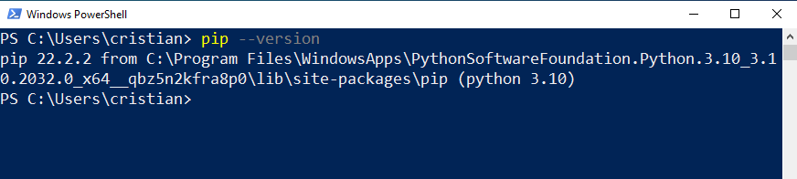
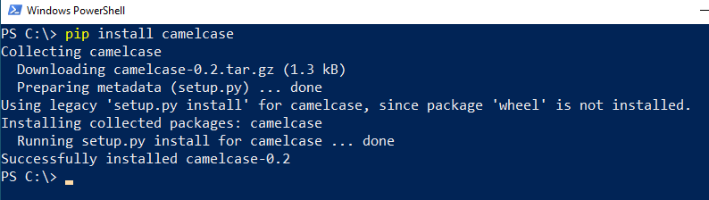

# Laboratorio 3
En este laboratorio usted aprenderá a:
- Instalar librerías para Python
- Entender el uso de las librerías y ejemplos prácticos

## Librerías

### Qué es una librería

En términos de programación, una librería es un conjunto de archivos con código de programación con una interfaz y documentación bien definida. El término proviene de una (mala) traducción de la palabra en inglés _library_, que en realidad significa biblioteca. Por esa razón nos referimos a librerías o bibliotecas como sinónimos.

Gracias a estas librerías, podemos concentrarnos en resolver un problema sin escribir gran parte del código desde cero, sino, que podemos usar el código escrito por un tercero, importarlo a nuestro código y poder usar su interfaz para resolver parte de nuestro programa.

En los desarrollos de la vida real, salvo en algunas excepciones, las y los programadores, desarrollan soportándose en librerías que se encuentren disponibles para usar.

Una librería al ser un conjunto de código de un tercero, debe haber una forma de importar ese código para poder usarlo. Es posible importar las librerías de distintas maneras, pero a continuación veremos como usar librerías en Python.

### Librerías y paquetes en Python

Python es uno de los lenguajes mas populares en estos tiempos. Y dispone de más de 402.931 paquetes (packages) para poder usar libremente. [Fuente](https://pypi.org/)

Hasta ahora hemos usado y en ocasiones importado a nuestro código parte de la librería estándar de Python sin instalar nada, pero a medida que nuestros proyectos se vuelven cada vez más complejos, será necesario apoyarnos en esas librerías para agilizar nuestro desarrollo.

Obviamente es posible instalar librerías para otros lenguajes, cada uno utiliza su propio manejador de paquetes, por ejemplo en Python se usa `pip` para instalar paquetes, en NodeJS se usa `npm`, `maven` para Java, `Ruby Gems` para Ruby.

> Nos referireos a librerías, módulos y paquetes como sinónimos.

### Instalando paquetes

En Python contamos con el manejador de paquetes o módulos `pip` que nos ayudará para instalar, desinstalar, listar y demás operaciones con estos paquetes.
A partir de Python 3.4, `pip` ya viene instalado por defecto.

#### Comprobar si pip está instalado

Para eso es necesario abrir una terminal de Linux o Powershell de Windows y escribir lo siguiente:

```bash
pip --version
```



En caso de no estar instalado, se puede instalar desde este [link](https://pypi.org/project/pip/).

Esa pantalla muestra que está instalada la versión 22.2.2 de pip.

#### Descargar e instalar paquetes

En este ejemplo probaremos instalar el paquete `camelcase`. Esa librería, permitirá poner en mayúscula la primer palabra de cada palabra de un string.

```powershell
pip install camelcase
```

Si todo salió bien, se mostrará una pantalla similar a la siguiente:


#### Usando la librería instalada

Ahora tenemos `camelcase` instalada, para usarla debemos ver la [documentación](https://pypi.org/project/camelcase/) de los desarrolladores. 

```python
import camelcase # Importación de librería instalada

c = camelcase.CamelCase()

txt = "hello world"

print(c.hump(txt)) 
```

Si corremos ese programa obtendremos como salida:
```bash
Hello World
```

La librería anterior se mostró solamente a fines de ejemplo. Fíjese que primero deberá instalar el paquete y luego importarla con `import` en su código y estará lista para usarse.

### Mas comandos de PIP

- `pip list`: Lista las librerías instaladas.
- `pip update <libreria>`: Actualiza la librería indicada
- `pip uninstall <libreria>`: Desinstala la librería indicada
- `pip show <libreria>`: Muestra información adicional sobre la librería indicada
- `pip freeze`: Muestra las librerías instaladas y sus versiones en formato _requeriments_.
- `pip freeze <libreria>`: Muestra la librería indicada, sus dependencias y respectivas versiones en formato _requeriments_.
- `pip --help`: Muestra un listado completo de comandos y una breve descripción de cada uno.

### Entornos virtuales

Antes de instalar cualquier paquete de Python, __se recomienda crear un entorno virtual__. Los entornos virtuales de Python nos permiten instalar un paquete de Python en _una ubicación aislada_ en lugar de instalarlo de manera global.

En un momento determinado nos encontraremos trabajando con varios proyectos y cada proyecto necesitará sus propios paquetes y tal vez, necesiten versiones específicas de cada paquete. Por esa razón se recomienda altamente realizar entornos virtuales. Pero para este laboratorio puede obviarlo pero sepa que los paquetes se instalarán de manera global en el sistema y no para un determinado proyecto.

Para mas información de como crear entornos virtuales, visite este [link](https://www.programaenpython.com/miscelanea/crear-entornos-virtuales-en-python/).


### Archivo requeriments

Si observamos código fuente de proyectos Python, a veces podemos ver en la carpeta raíz del proyecto un archivo llamado `requeriments.txt`. El archivo contiene una lista de las librerías que usará el proyecto con sus versiones correspondientes.

Por ejemplo, el contenido de un archivo `requeriments.txt` puede ser el siguiente: 

```
Faker==15.0.0
python-dateutil==2.8.2
six==1.16.0
```

Se puede ver que el proyecto usará las librerías, `Faker` en su versión 15.0.0, `python-dateutil` en su versión 2.8.2 y `six` en la versión `1.16.0`

Si bien, se pueden instalar paquetes sin indicar la versión (lo que instalará la versión mas reciente), es __una MUY buena práctica__ tener documentada __las versiones__ que usaremos en nuestras librerías, ya que si la librería está en constante desarrollo, una actualización puede hacer que nuestro proyecto no funcione correctamente cuando queramos utilizar el código.

Si quiere instalar las librerías que se encuentran listadas en un archivo `requeriments.txt` debe hacer lo siguiente:

`pip install -r requirements.txt`

Respecto a las versiones, las librerías suelen usar _Versionado semántico_ (Semver) o una notación similar.

Vea mas documentación sobre [SemVer](https://semver.org/lang/es/) y sepa como versionar su software.

## Librería Faker

En este Lab, veremos la utilización de la librería [Faker](https://faker.readthedocs.io/en/master/).
Según su documentación, Faker se describe como un paquete de Python que genera datos falsos. Ya sea que necesite iniciar una base de datos, crear documentos, completar su persistencia para realizar pruebas de estrés o anonimizar los datos tomados de un servicio de producción, Faker es para usted.

Es decir, Faker es una librería que nos genera datos falsos según le pidamos.

Por ejemplo, puede generarnos nombres de personas, apellidos, direcciones, códigos postales, nombres de ciudades, cualquier cosa en la que haya sido programada.

La librería está actualmente en constante desarrollo y es bueno echar un vistazo a la documentación cada tanto para ver las novedades.

[Faker Doc](https://faker.readthedocs.io/en/master/)

[Faker GitHub repo](https://github.com/joke2k/faker)

#### Instalando Faker

Para instalar la librería, simplemente vaya a una consola de PowerShell o terminal de Linux y escriba:

```powershell
pip install faker
```

Luego de instalar las _dependencias_ necesarias, se instalará Faker y ya estará disponible para usarla.

#### Usando Faker

Cree un nuevo archivo `prueba_faker.py` y pegue el siguiente contenido:

```python
from faker import Faker
fake = Faker()

nom = fake.name()
dir = fake.address()
tex = fake.text()

print(f"Nombre: {nom}\nDirección: {dir}\n")
```

El output puede ser algo como este:

```
Nombre: Sheila Doyle
Dirección: Unit 7227 Box 7193
DPO AA 99185
```

Podemos notar dos cosas,
1) Probablemente los nombres, dirección y textos que usted obtuvo no son los mismos que están en la práctica.
2) Los datos están en inglés y no se parecen a datos que nos puedan ser útiles.

Para responder al punto 1, diremos que la librería Faker, _randomiza_ los datos y cada vez que ejecute pidiendole datos generará otro dato aleatorio.

Y 2, es posible cambiar el idioma de Faker. Vamos a mejorar el código de la siguiente manera:


```python
from faker import Faker
fake = Faker('es_ES') # Se inicia Faker con idioma español de España

nom = fake.name()
dir = fake.address()

print(f"Nombre: {nom}\nDirección: {dir}")
```

La salida puede ser algo así:

```
Nombre: Edelmira de Arellano
Dirección: Avenida de Sosimo Girón 66 Puerta 3 
Cádiz, 28915
```

Si bien mejoró, aún son datos pocos reales para nuestras latitudes. Lamentablemente aún no está implementado para nuestro país. _¿Alguien se animará a agregar los datos de nuestro país? (Guiño-guiño)_.

Hay un listado de los _locales_ (idiomas) hasta el momento implementados en este [link](https://faker.readthedocs.io/en/master/locales.html).

### Métodos de Faker

Si utilizamos `fake = Faker('es_ES')` en nuestro código, podemos utilizar sus métodos, y nos devolverá un dato generado aleatoriamente. Por ejemplo:


- `fake.country()`: Un país aleatorio en formato español.
- `fake.name()`: Un nombre completo de una persona.
- `fake.first_name()`: Solo el nombre de una persona.
- `fake.first_name_female()`: Un nombre de mujer.
- `fake.first_name_male()`: Un nombre de varón.
- `fake.last_name()`: Un apellido.
- `fake.address()`: Un domicilio completo.
- `fake.street_address()`: El nombre de una calle.
- `fake.license_plate()`: Una matrícula de vehículo.

Tiene un listado completo de los métodos [aquí](https://faker.readthedocs.io/en/master/locales/es_ES.html).


## Convierta texto en audio

En el siguiente ejemplo verá que con apenas unas pocas líneas de código podrá reproducir audio a partir de un texto enviado.

Para esto deberá instalar dos librerías:
- `gtts`: Utiliza Google Text-to-Speech. [Doc](https://pypi.org/project/gTTS/)
- `playsound`: Para reproducir el sonido [Doc](https://pypi.org/project/playsound/). (Opcional)

#### Instalación
```
pip install gtts playsound
```

#### Ejemplo

```python
from gtts import gTTS

from playsound import playsound

audio = 'audio.mp3'

language = 'es'

texto = "Hola a todos los desarrolladores y desarrolladoras del CFP"

sp = gTTS(texto, lang=language, slow=False)

sp.save(audio)
playsound(audio)
```

## Generador de códigos QR

En este ejemplo veremos como podemos generar imágenes de códigos QR de un texto.

Se utilizarán las librerías :
- `qrcode`: Para generar el QR. [Doc](https://pypi.org/project/qrcode/)
- `pillow`: Para generar la imágen. [Doc](https://pypi.org/project/Pillow/)

#### Instalación
```
pip install qrcode pillow
```

#### Ejemplo

```python
import qrcode  # Importamos el modulo para generar QR

texto = "Hola a todos los desarrolladores y desarrolladoras del CFP"

imagen = qrcode.make(texto)
archivo_imagen = open('qr.png', 'wb')
imagen.save(archivo_imagen)
archivo_imagen.close()
```
Se generará un archivo `qr.code` con el mensaje


## Descargar contenido de YouTube

Se utiliza la librería:
- `pytube`: Librería que permite descargar contenido de YouTube [Doc](https://pytube.io/en/latest/index.html)

#### Instalación

```
pip install pytube
```

#### Descargar un video

```python
from pytube import YouTube 
# La carpeta donde se guardará
CARPETA = "./"  
# Link del video a descargar
LINK='https://www.youtube.com/watch?v=dQw4w9WgXcQ'

yt = YouTube(LINK) 

d_video = yt.streams.get_by_itag(22)

d_video.download(CARPETA) 
```

#### Descargar solo el audio

```python
from pytube import YouTube

# La carpeta donde se guardará
CARPETA = './'
# Link del video a descargar
LINK = 'https://www.youtube.com/watch?v=dQw4w9WgXcQ'

yt=YouTube(LINK)
t=yt.streams.filter(only_audio=True).first()
t.download(CARPETA)
```

## Librería Pygame

Sin lugar a dudas, cuando se habla de desarrollar juegos en Python se piensa en `pygame`. Pygame es un conjunto de librerías diseñadas para desarrollar video juegos en 2D.

#### Instalación

Puede instalar la librería con el siguiente comando:

```pip install pygame```

### Probar un juego

Pygame como muchas otras librerías incluye ejemplos de uso de librería. Muchas veces los ejemplos provistos por los desarrolladores. Modificando  y probando los ejemplos podemos entender su funcionamiento.

Ejecute el siguiente comando:

```python -m pygame.examples.aliens```

¿Qué ha pasado?... ¿Se anima a escribir su propio juego en 2D utilizando Pygame?.
Vea el código fuente de "aliens" [aquí](https://github.com/pygame/pygame/blob/main/examples/aliens.py) y analice el código para ver como desarrollan otros desarrolladores.


## Otras librerías que pueden ser útiles

- `tkinter`(tk): Crear interfaces gráficas simples "desktop" en Python. [Doc](https://docs.python.org/es/3/library/tkinter.html)
- `pysimplegui`: Crear interfaces gráficas "desktop" para nuestras aplicaciones. [Doc](https://www.pysimplegui.org/en/latest/)
- `wxPython`: Crear interfaces gráficas para Python. [Doc](https://pypi.org/project/wxPython/)
- `django`: _Framework_* para crear aplicaciones Web con Python. [Doc](https://docs.djangoproject.com/en/4.1/)
- `requests`:  Biblioteca HTTP elegante y simple para Python. Permite obtener datos desde una página web. [Doc](https://requests.readthedocs.io/en/latest/)
- `pandas`: Manejo y análisis de estructuras de datos. [Doc](https://pandas.pydata.org/docs/)
- `arcade`: Crear juegos. Alternativa a pygame. [Doc](https://api.arcade.academy/en/latest/)


## Sugerencias para utilizar una librería

Las librerías forman parte del desarrollo de nuestras aplicaciones. Cuando nuestras aplicaciones pasan de ser simples ejercicios de programación lo mas probable es que nos apoyemos en librerías que nos simplifiquen parte de lo que necesitamos hacer.

Para eso debemos saber que tenemos que resolver y buscar si hay algunas librería ya implementada. Obviamente los buscadores de internet nos ayudarán en esta tarea. 

Como sugerencia, siempre es buscar librerías que estén en desarrollo y no hayan quedado _deprecadas_ (obsoletas, sin mantenimiento). Para saber esto solo basta con ver la última actualización desde [pypip](https://pypi.org/) o desde el repositorio de la librería, por lo general sus respectivos repositorios se encuentran en GitHub o GitLab.

También hay que prestar atención a la __licencia__ con la cual está publicada la librería de manera de saber qué uso podemos darle y si es compatible con nuestro proyecto. Algunas licencias de software libre, como la [GPLv3](https://es.wikipedia.org/wiki/GNU_General_Public_License#Compatibilidad_y_licencias_m%C3%BAltiples) (licencia restrictiva) exige que los programas que usen el código de esa librería sean publicados bajo la misma licencia. 


