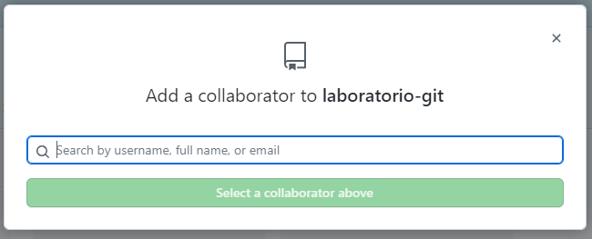

# Laboratorio 3
En este laboratorio usted aprenderá a:
- Integrar Git con Github
- Trabajo en equipo de desarrollo
- Git Flow y otros Workflows


[Cheat-sheet Git](https://training.github.com/downloads/es_ES/github-git-cheat-sheet.pdf) (Machete ;)

## GitHub

Github es un servicio web para almacenamiento de repositorios Git. Actualmente es el más popular.
Los servicios de almacenamientos de repositorios git como [Github](https://github.com/), [GitLab](https://about.gitlab.com/), [Bitbucket](https://bitbucket.org/), etc incluyen otros conceptos además de los ya vistos como _commits_, _branchs_, _merge_, etc ¡y están en constante cambio!. Por lo que en este laboratorio veremos algunos de esos conceptos y para que se usa a modo de conocer la terminología.

### Issue

Los issues se usa en un repositorio para que los desarrolladores o público general (si el repositorio es público) intercambien y rastreen ideas, reporten errores (bugs), realicen _propuestas_ para mejorar el software, hacer de lista de tareas y a veces debates entre alguna parte del software.

Los _issues_ [se crean](https://docs.github.com/es/issues/tracking-your-work-with-issues/creating-an-issue) y se cierran cuando la discusión haya concluido o el bug haya sido corregido.

Puede encontrar mas información sobre los _issues_ ("propuestas" en su "traducción" :unamused: ) [aquí](https://docs.github.com/es/issues/tracking-your-work-with-issues/about-issues).

### Pull-request


## Paso 1

Elija un o una compañera del curso para realizar este lab.

## Paso 2 - Crear repositorio

Una de las personas, debe crear un nuevo repositorio en la plataforma que usted elija. El repositorio debe llamarse, por ejemplo: `laboratorio-git`.
El repositorio debe cumplir las siguientes características:
- Visibilidad public
- Add a README file*
- Add .gitignore : Python


> __README file__: Los readme file son lo primero que aparecen cuando accedemos a un repositorio en GitHub/GitLab. Es recomendado tener un readmefile descriptivo. Se utiliza Markdown como formato para documentar el software. [Machete ;)]([file:///C:/Users/giambcri/Downloads/rmarkdown_es.pdf](https://raw.githubusercontent.com/rstudio/cheatsheets/main/translations/spanish/rmarkdown_es.pdf))

> __¿Qué es .gitignore?__: Se utiliza para que Git ignore archivos y no los sugiera para seguimiento. Esos archivos pueden ser temporales, de configuración librerías, entornos virtuales, etc. Se recomienda fuertemente utilizar el archivo `.gitignore` siempre que sea posible para mantener limpio el repositorio de esos archivos. Cada lenguaje tiene su lista de archivos a ignorar por eso es bueno echar un vistazo a las opciones que Github brinda

## Paso 3 - Invitar colaborador al repositorio

El o la alumna que haya creado el repositorio, diríjase al repositorio en cuestión y elija las opciones `Settings` > `Collaborators` (Le pedirá la constraseña para asegurar su identidad) > `Add people` y escriba el usuario o e-mail se su compañero o compañera de curso.



Luego de elegir un colaborador, se enviará un link de invitación para colaborar. 
Una vez que el colaborador acepte la invitación para ser miembro del repositorio podrá acceder al repositorio.

## Paso 4 - Estableciendo "Workflow"

Un _Workflow_ o flujo de trabajo es una forma de organizarse entre desarrolladores y establecer branchs para cada fase del desarrollo del software. Hay varias formas de trabajar con _Workflows_ y no son obligatorias sino es mas una convención que pueden tener entre los desarrolladores o lo establece el líder de proyecto.

En este proyecto estableceremos un "simil" __Git Flow__ para tener un contacto en esta forma de trabajo.

### Branchs en Git Flow

- **Master (main)**: Es la rama principal del proyecto. Contiene el código de producción. NUNCA trabajaremos sobre ella. De esta rama no nace ninguna excepto los _hotfix_.
- **Develop**: Es la rama de desarrollo. NUNCA trabajaremos sobre ella. De esta rama nacen todas las ramas de _feature_. La rama _develop_ se mergeará con _master_ cuando vayamos a desplegar el proyecto a través de las _releases_.
- **Feature**: Serán las ramas sobre las que trabajaremos normalmente. Llevan por defecto el prefijo feature/ seguido del nombre de la rama (ej: `feature/add-new-feature`). Nacen SIEMPRE desde la rama _develop_ y mueren cuando son mergeadas.
- **Hotfix**: son las ramas que utilizaremos para corregir errores críticos encontrados en producción. Llevan el prefijo hotfix/ seguido del nombre de la rama (ej: `hotfix/fix-error_con_numeros`). Nacen SIEMPRE desde la rama _master_ y se mergean contra _master_ y _develop_, con el objetivo de poner el _hotfix_ en producción y que también esté disponible para nuevos evolutivos en la rama de desarrollo.
- **Release**: Son las ramas que utilizaremos para crear nuevas versiones para desplegar a producción. Llevan el prefijo release/ seguido del número de versión. Es el mecanismo a través del cual mergeamos los nuevos desarrollos que tenemos en develop contra master. Es recomendable utilizar [SemVer](https://semver.org/lang/es/) para los números de versión.
- **Bugfix**: son ramas que se utilizan para corregir errores que aún no han llegado a producción. Llevan el prefijo bugfix/ seguido del nombre de la rama (ej: `bugfix/fix-error-listado`). Nacen SIEMPRE desde la rama develop.

La siguiente imágen puede darle una idea de como trabaja Git Flow:


Puede consultar mas info y otros Workflows [aquí](https://www.babelgroup.com/es/Media/Blog/Abril-2021/Cinco-Git-Workflows-para-mejores-proyectos).

Para muestra práctica y __por simplicidad__ usaremos las siguientes branchs:
- `main`: Rama principal
- `develop`: Rama de desarrollo
- `feature/s`: Para ir agregando las características.
- `hotfix`: Rama para realizar un arreglo de un bug.

## Paso 5 - Clonar repositorios a nuestras estaciones de trabajo

Tal como hicimos en [la práctica 10](https://github.com/kity-linuxero/prog_CFP410/blob/main/practicas/practica10.md#clonar-un-repositorio-existente), clonemos el repositorio que vamos a trabajar.

### Trabajando con repositorios remotos

Hasta el momento, hemos trabajado con repositorios locales. Los commits que hacíamos quedaben en nuestra PC.
Ahora, como estamos trabajando con repositorios locales Y remotos tenemos que tener en cuenta lo siguiente:

- Nuestros commits, seguirán estando en nuestra PC local y no se subirán al repositorio remoto (GitHub) hasta que se lo indiquemos.
- Si nuestro colega quiere obtener los últimos cambios, tendrá que traerse las actualizaciones del repositorio remoto


### Configurar git

Si estamos trabajando en nuestra PC es probable que ya lo hayamos hecho, pero si estamos en una PC de acceso público, abramos la carpeta donde clonamos en repositorio y realizaremos la configuración del git

### Enviar nuestros commits al repositorio remoto*

*Nos pedirá autenticación con GitHub. 

```bash
git push -u origin [nombre_rama]
```

> `origin` es el nombre con el que se conoce al repositorio remoto por defecto. Es un nombre abreviado para no tener que escribir toda la url del repositorio.

Por ejemplo, si estamos trabajando sobre `develop` el comando para actualizar nuestros commits al repositorio remoto será:

```bash
# Push de tus commits la primera vez, si quieres enviar tu rama al repositorio remoto.
git push -u origin develop
```

ó

```bash
# Push normal. Cuando la rama ya existe en el repositorio remoto.
git push
```

Para eso, el dueño del repositorio haga lo siguiente:
- Crear el branch develop: 
  ```bash
  git switch -c develop
  ```
- Subir el branch al repositorio remoto:
    ```bash
    git push -u origin develop
    ```

## Primer commit

Realicemos algunas modificaciones de nuestro trabajo práctico de [Reloj en español](https://github.com/kity-linuxero/prog_CFP410/blob/main/labs/lab2.md#reloj-en-espa%C3%B1ol) del Laboratorio 2.

- Alguno de los dos integrantes copie el programa hecho en tal laboratorio 2 y copielo al repositorio.
- En el branch `main` renombre el archivo como `reloj_es.py`.
- Haga un commit con el nuevo archivo.
- Realice un `git push origin main` para subir los cambios.
- El otro integrante realice un `git pull` y traerá los últimos cambios.

## Organizando los roles

1) En una primera etapa, el desarrollador del reloj debe acomodar el código en el repositorio. Para eso debe pararse en la rama `develop` y realizar el merge desde `main`. Luego deberá crearse el branch `feature/refactoring` y deberá trabajar en ese branch, realizando los commits necesarios.

    ```bash
    git switch develop
    git merge main
    git push origin develop
    git switch -c "feature/refactoring"
    ```
    En ese branch trabajará para que sea posible ejecutarse el programa desde la consola escribiendo `python reloj_es.py` y el mismo debe imprimir _la hora actual_.


2) El desarrollador #2 debe actualizar su branch `develop`. Por lo que seguido al 1) el desarrollador #2 debe ejecutar un `git pull` para actualizarse su repositorio.

    ```bash
    git pull
    ```

    El desarrollador 2, ya que no es el usuario que ha desarrollado el código debe analizar el programa para poder entender su funcionamiento. Si encuentra un error o alguna sugerencia, debe ir a la URL del repositorio y crear un [issue](https://docs.github.com/es/issues/tracking-your-work-with-issues/creating-an-issue) informando lo observado. Si es un error, debe poner los datos para que sea posible reproducir el error.
    Si hay mas de un error o sugerencia, realice un issue por cada uno.


