# Práctica 10

## Git

## Instalación de Git

Según su sistema operativo, siga las instrucciones de los siguientes enlaces:
- <a href="https://www.hostinger.com.ar/tutoriales/instalar-git-en-distintos-sistemas-operativos#Instalar_GIT_en_Windows" target="_blank">Instalación en Windows</a>. Instalar también Git bash
  -  <a href="https://www.geeksforgeeks.org/how-to-integrate-git-bash-with-visual-studio-code/" target="_blank">Integrar Git bash en Visual Studio Code</a>
- <a href="https://www.hostinger.com.ar/tutoriales/instalar-git-en-distintos-sistemas-operativos#Instalar_GIT_en_Linux" target="_blank">Instalación en Linux</a>
- <a href="https://www.hostinger.com.ar/tutoriales/instalar-git-en-distintos-sistemas-operativos#Instalar_GIT_en_MacOS" target="_blank">Instalación en MacOS</a>


### Preparar entorno

- Cree una carpeta nueva en algún lugar y abra esa carpeta con el editor Visual Studio Code
- En Visual Studio Code click en `Terminal` > `Nuevo terminal`
  - Seleccione como su terminal Git Bash:

  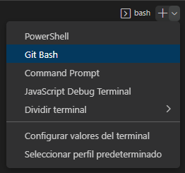
- Para hacer mas fácil el aprendimiento, instale la extensión para Visual Studio Code [Git Graph](https://marketplace.visualstudio.com/items?itemName=mhutchie.git-graph).

### Configurar Git por primera vez

La primera vez que vamos a usar Git, necesitamos configurar nuestro usuario y dirección de e-mail. Se sugiere usar el usuario y mail que se usa en GitHub.
Si estamos en nuestra PC personal ejecute el siguiente comando cambiando a su nombre y dirección de email:

```bash
git config --global user.name "Lalo Landa"
git config --global user.email landa@example.com
```

Si estamos en una PC compartida o del CFP, el comando a ejecutar será distinto mas adelante.

[Referencia](https://git-scm.com/book/es/v2/Inicio---Sobre-el-Control-de-Versiones-Configurando-Git-por-primera-vez)


### Crear un repositorio

- En la terminal de Git Bash escriba el siguiente comando para iniciar un repositorio nuevo: 
```bash
git init
```

### Config repo local

Si estamos en una PC del CFP ejecute:

```bash
git config --local user.name "Lalo Landa"
git config --local user.email landa@example.com
```

### Trabajando con Git

- Cree un archivo llamado `programa.py` con el siguiente contenido:
```python
print("¡Hola Git!")
```

- Revise el estado del repositorio:
```bash
git status
```

Le saldrá la siguiente información:
```bash
$ git status
On branch master

No commits yet

Untracked files:
  (use "git add <file>..." to include in what will be committed)
        programa.py

nothing added to commit but untracked files present (use "git add" to track)
```
Donde podemos destacar información muy importante:
- El branch donde estamos parados, en este caso es `master`. (En su caso puede ser `master` o `main`.)
- Hay archivos sin seguimiento, en este caso `programa.py`
- Y un mensaje indicándonos que no hay archivos agregados para commit pero hay archivos sin seguimientos que podrían agregarse.

### Agregando archivos al staged area

Recuerden que, antes de hacer un commit, es necesario preparar los archivos en el staged area para pasarlos luegos al commit.

Ejecute el siguiente comando para agregar los archivos al _staged área_ para luego pasarlos a un _commit_:
```bash
git add programa.py
```

Consulte nuevamente el estado del repositorio con 
```bash
git status
```

La salida será similar a la siguiente:

```bash
$ git status
On branch master

No commits yet

Changes to be committed:
  (use "git rm --cached <file>..." to unstage)
        new file:   programa.py
```

Podemos observar dos cosas interesantes:
- New file: `programa.py`. El archivo está preparado para ser agregado a un commit.
- Es posible quitarlo del stage (por si hemos agregado un archivo por error) con el comando `git rm --cached programa.py`

### Nuestro primer commit

Ejecute el siguiente comando:

```bash
git commit -m "Primer commit"
```

Puede salirle un mensaje como el siguiente indicando que el commit se creó correctamente:
```bash
$ git commit -m "Primer commit"
[master (root-commit) 4047f3c] Primer commit
 1 file changed, 1 insertion(+)
 create mode 100644 programa.py
```

- Consulte el estado del repositorio con `git status`

```bash
$ git status
On branch master
nothing to commit, working tree clean
```

- Pruebe ver los registros de los últimos commits con `git log`

```bash
$ git log
commit 4047f3c452274e81fbe6ce183304fcdb31b2bf20 (HEAD -> master)
Author: Lalo Landa <landa@example.com>
Date:   Thu Oct 6 10:02:06 2022 -0300

    Primer commit
```

Modifiquemos el archivo `programa.py` agregandole otra línea quedando de la siguiente manera:

```python
print("¡Hola Git!")
print("¡Chau Git!")
```

Revise el estado del repositorio con `git status`.

¿Qué ha pasado?.

Como se puede observar, cada vez que agreguemos o modifiquemos un programa, el archivo se marcará como estado `modified`. Si queremos que el archivo se guarde en el repositorio hay que enviarlo nuevamente al `staged area` y luego realizar otro commit.

Ejecute los siguientes comandos:

``` bash
git add programa.py
git commit -m "Segundo commit"
git log
```

Verifique con el complemento Git Graph

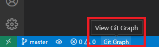


## Seguimos con nuestro programa

Creemos un archivo llamado `mod.py` con el siguiente contenido:

```python
from mod import mes

print("¡Hola Git!\n")

mes()

print("¡Chau Git, hasta luego!")
```

Modifiquemos nuestro `programa.py` de la siguiente manera.

```python
import calendar
import datetime

def mes():
    '''
    Imprime el mes actual
    '''
    today = datetime.date.today()   
    print (calendar.month(today.year, today.month))
```

#### Verifiquemos el estado del repositorio

```bash
$ git status
On branch master
Changes not staged for commit:
  (use "git add <file>..." to update what will be committed)
  (use "git restore <file>..." to discard changes in working directory)
        modified:   programa.py

Untracked files:
  (use "git add <file>..." to include in what will be committed)
        __pycache__/
        mod.py

no changes added to commit (use "git add" and/or "git commit -a")
```

Podemos observar:
- Que `programa.py` está modificado.
- Hay nuevos archivos que están sin seguimiento: `mod.py` y una carpera que se creó `__pycache__/` 

Por el momento vamos a ignorar la carpeta `__pycache__/`, ya que no es relevante para nuestro código. Mas adelante veremos como hacer para que no aparezcan en nuestro repositorio archivos temporales creados por el intérprete.

Agreguemos al staged los archivos `programa.py` y `mod.py` y hagamos un nuevo commit.

```bash
git add programa.py mod.py
git commit -m "Se agrega funcionalidad de calendario del mes"
```

Es posible hacerlo de forma gráfica con Visual Studio Code de la siguiente manera:

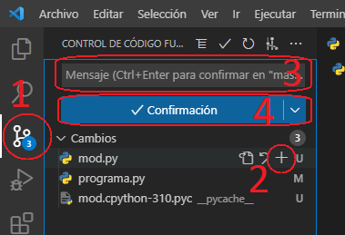

Si hicimos los pasos quedará así:

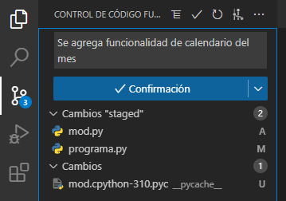

Si hicimos todo bien, consultamos en Git Graph y tendría que salir: 

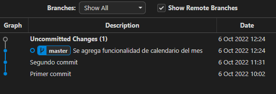

### Creando branch

En lo siguiente vamos a crear un branch para corregir una funcionalidad a nuestro código, ya que por defecto, el primer día de la semana en la librería `calendar` es el lunes. 

Para trabajar de forma mas ordenada vamos a crear una rama o branch y trabajar de forma paralela a la rama `main` o `master`.

Para crear un branch podemos hacerlo de varias formas:

Por comandos:

```
git switch -c "fix_dia_semana"
```

De forma gráfica:

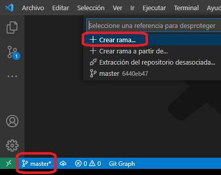

Si hicimos todo bien, podemos ver que ya estamos parados en la nueva rama `fix_dia_semana`:

```bash
git status

On branch fix_dia_semana
```

Y en vs code veremos:

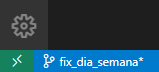

### Mejorando nuestro programa

Modifiquemos nuestro archivo `mod.py` de la siguiente manera:

```python
import calendar
import datetime

def mes():
    '''
    Imprime el mes actual
    '''
    today = datetime.date.today()
    calendar.setfirstweekday(calendar.SUNDAY) # Se cambia el primer día
    print (calendar.month(today.year, today.month))
```

Antes de realizar los commits, es _buena práctica_ ver cuales son los cambios que hicimos. Visual Studio y otro IDEs suelen mostrar los cambios con colores al costado del número de línea como puede ver en las líneas 8 y 9. El color verde muestra que una línea fue agregada, una azul modificada y roja que fue eliminada.

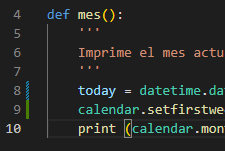

Para ver en mas detalle qué se ha agregado, eliminado o agregado es posible hacerlo desde Visual Studio de la siguiente manera:

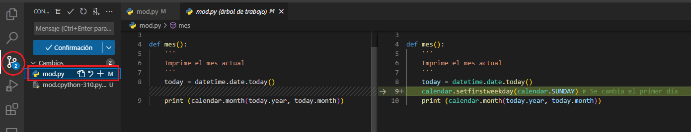

O, como siempre desde la consola con:

```bash
git diff
```

#### Haciendo un nuevo commit

Hagamos un nuevo commit llamado "Fix primer dia".

Antes que hagamos el commit, verificar siempre que los archivos modificados estén en el _staged_ como se muestra en la imágen:

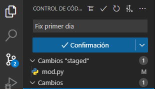

- Verifique _Git Graph_ y observe el nuevo branch respecto al _master_. Como Puede verse, la rama _fix_dia_semana_ ha sobrepasado al _master_.

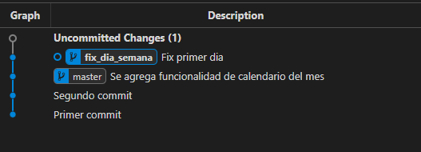

#### Cambio de rama y merge

Volver a la rama `master` o `main`.

Desde consola:

```
git switch master
```

O desde forma gráfica

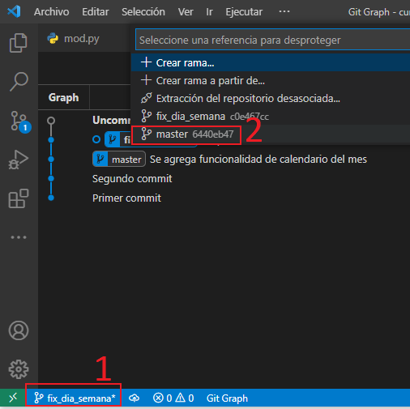

- Al cambiar nuevamente a la rama master, verá que los cambios han desaparecido.
- Observe el archivo `mod.py`

### Merge

Vamos ahora a _mergear_ la rama _fix_dia_semana_ con _master_ de esa forma nos traemos a la rama principal los nuevos cambios.

Desde la consola ejecute:

```bash
git merge fix_dia_semana
```

Si todo sale bien, saldrá el siguiente output:

```bash
$ git merge fix_dia_semana
Updating 6440eb4..c0e467c
Fast-forward
 mod.py | 3 ++-
 1 file changed, 2 insertions(+), 1 deletion(-)
 ```

- Ahora las ramas `master` y `fix_dia_semana` están juntas.
- Compruebe con Git Graph los cambios.

## Clonar un repositorio existente

Como hemos visto en la clase teórica, hay dos formas de iniciar un repositorio en Git:
- Crear uno desde cero (como hicimos en esta práctica anterior)
- Clonar un repositorio existente.

Para eso, vamos a crear un repositorio nuevo desde Github.

Cree un repositorio llamado `prueba-curso`.
- Visibilidad public
- Add README file
- Add `.gitignore` y seleccione el template Python.
  - El archivo `.gitignore` será una lista de archivos, carpetas que nuestro repositorio deberá ignorar.
  - Anteriormente hemos visto que, cuando importamos módulos se crea una carpeta llamada `__pycache__/` que el repositorio lo muestra como archivos sin seguimiento, pero que en realidad no forman parte de nuestro proyecto. Con `.gitignore` esto ya no será una molestia.


Una vez en el repositorio, siga las instrucciones:

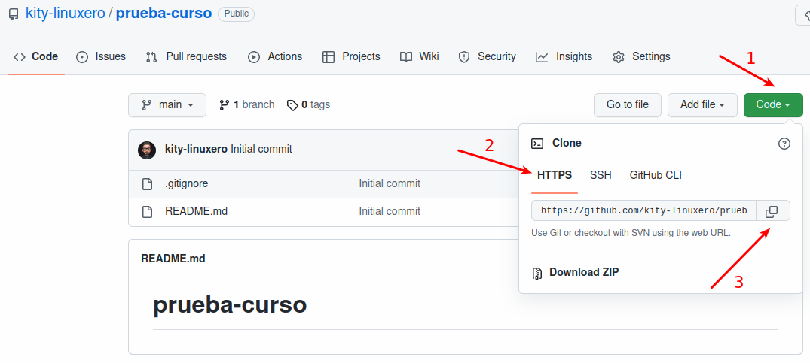

ejecute el siguiente comando desde Git Bash:
```bash
git clone <contenido portapapeles>
```

Lo que le quedará algo así:

```bash
git clone https://github.com/kity-linuxero/prueba-curso.git
```

Esto clonará el repositorio de Github y lo descargará a su máquina. Por defecto la carpeta se llamará como el repositorio.