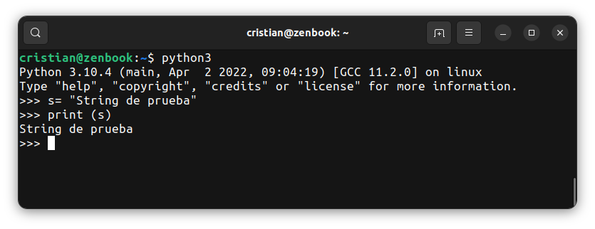
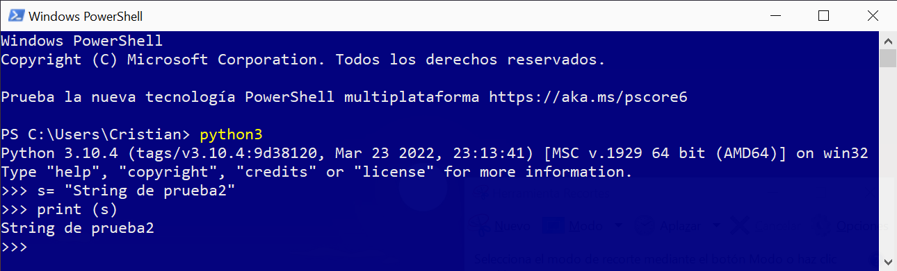
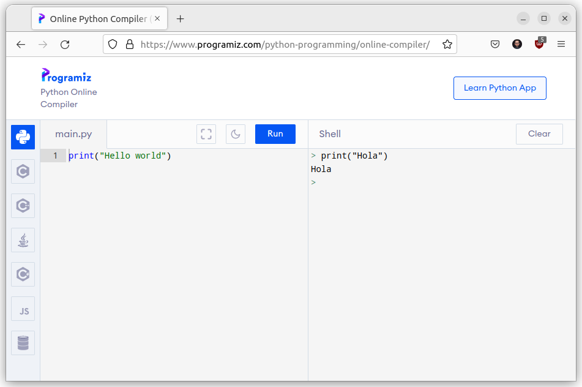
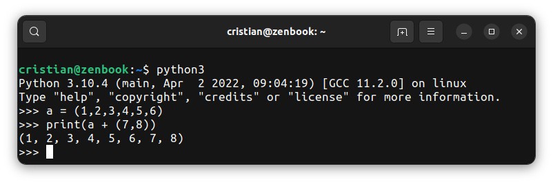

# Práctica 5

En esta práctica aplicaremos temas vistos a modo de repaso y veremos métodos y funciones útiles que nos servirán en la vida real programando sumado a unos tips.

## Procesamiento de strings

### Introducción

Los strings pueden ser tratados como listas o arrays. Esto es así en muchos lenguajes. Por ejemplo, podemos tener el siguiente código:

```python
# Acceder a una letra en particular. Podemos verla como la posición en un array o una lista.
nombre = "Cristian"
print (nombre[0])
```
#### Output:
```bash
C
```
#### Iterar en un string

```python
nombre = "Cristian"

for l in nombre:
    print (l)
```

#### Output:
```bash
C
r
i
s
t
i
a
n
```

También tenemos varios métodos para usar en strings. Algunos los vimos en las clases, otros puede consultarlos en [este link](https://ellibrodepython.com/cadenas-python).


### Porciones de cadenas

Llamamos _porción_ a un segmento de una cadena. La selección de una porción es similar a la selección de un caracter. Donde puede hacerse referencia a una `cadena[desde:hasta]` para acceder a un segmento de la misma. 

Observe este ejemplo en Python (en modo interactivo).

```py
>>> s = "Pedro, Pablo, y Marı́a"
>>> print (s[0:5])
Pedro
>>> print (s[7:12])
Pablo
>>> print (s[15:20])
Marı́a
```
La operación para obtener la porción de una cadena también funciona en listas y tuplas.

## Modo interactivo (tip)

En modo interactivo, interactuamos directamente sobre el intérprete de Python. Puede ser útil para probar algunas líneas antes de pasarlas a nuestro código. Se puede acceder al modo interactivo si se tiene instalado Python en la computadora y desde una consola del sistema operativo (por lo general es `CMD` o `PowerShell` en Windows, `bash` o `sh` en Linux, `zsh` en Mac).

El `prompt` indicará con `>>>` que está listo para recibir comandos.






Tambien puede ejecutar una shell de Python en una web sin tener siquiera instalado Python en su computadora. A continuación se muestra un ejemplo de la web [Programiz]("https://www.programiz.com/python-programming/online-compiler/"). La Shell, como se puede ver, aparece en la parte derecha de la página.



En la parte interactiva, puede realizar pruebas, por ejemplo si es posible ejecutar alguna acción sobre un tipo de datos o probar alguna operación sobre algún dato. En el siguiente ejemplo se prueba si es posible concatenar una tupla con otra.




# Parte práctica


## Ejercicio 1

Escriba __una función__ que retorne el la cantidad de caracteres que contiene una cadena __enviada por parámetro__.

Ejemplo del programa en ejecución:
```bash
Ingrese una cadena para procesar: Hola a todos
La cadena contiene 12 caracteres.

```

## Ejercicio 2

Escribir __una función__ que imprima cada caracter de un string enviado por parámetro.
La cadena debe ser enviada por teclado desde el programa principal.

Ejemplo del programa en ejecución:
```bash
Ingrese un string para procesar: CURSO
La letra 1 es: C
La letra 2 es: U
La letra 3 es: R
La letra 4 es: S
La letra 5 es: O
```

## Ejercicio 3

Escribir __una función__ que pida un string y luego un caracter y cuente la cantidad de veces que aparece un caracter en una cadena. El valor debe retornarlo como resultado de la función y ser impreso desde el programa.

A continuación un ejemplo de como debe quedar el programa

```bash
Ingrese un string para procesar: PROGRAMACION
Ingrese un caracter para buscar: O
El caracter O aparece 2 veces
```

## Ejercicio 4

Escriba __una función__ que retorne la cantidad de palabras que contiene una cadena. Por ejemplo:
```
"Hola a todos" # Debe retornar 3
"Hola" # Debe retornar 1
"Nos invitaron a un lugar que tenía buena pinta pero al final resultó ser súper random" # Debe retornar 16
```

## Ejercicio 5

Escriba un programa que reciba una cantidad de nombres de personas. Luego los imprima pero con la primer letra en mayúsculas y el resto en minúscula.

Por ejemplo:

```bash
Ingrese un nombre: cristian
Ingrese un nombre: DAVID
Ingrese un nombre: aNTOneLla
Ingrese un nombre: .

Las personas son:
Cristian
David
Antonella

```

Muchos lenguajes proveen mecanismos similares al visto en ese ejercicio.

## Ejercicio 6

Escriba __una función__ que retorne (por True o False) si una subcadena está incluída en una cadena.
Por ejemplo:

```bash
estaEn(Ana, Amanda) # Debe retornar False
estaEn(Ana, Ananda) # Debe retornar True
```

## Ejercicio 7

Escriba __una función__ que retorne el máximo __y__ el mínimo de la siguiente lista:

`[23, 56, 11, 677, 0, 77, 44, 33]`

Pista: Retorno múltple de funciones ;)


