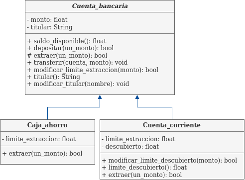

# Práctica 9

## Programación orientada a Objetos - Parte II

En esta práctica nos concentraremos en consolidar los temas vistos en teorías, **clases**, **objetos**, **métodos**, **atributos**, **herencia**, **polimorfismo**, **encapsulación** y **abstracción** que son los conceptos básicos de la programación orientada a objetos.

También se introducirá el concepto de diagrama de clases UML.

## Introducción al diagrama de clases UML

Un programa informático tiene diversas formas de representarlos. Ver el código fuente y armar mentalmente las clases con la que está compuesto nuestro programa suele ser complicado cuando la solución es compleja.

Hasta el momento hemos visto soluciones muy simples con unas pocas clases, pero a continuación introduciremos un concepto para diagramar clases conocido como _Diagrama de clases UML_.

### Un ejemplo de diagrama de clases UML

En un diagrama de clase se puede especificar el nombre de la clase, sus atributos y, opcionalmente su tipo de datos, sus métodos con sus parámetros de entrada, opcionalmente el tipo de datos de retorno, la visibilidad de los métodos y atributos y la relación entre las clases.


En la visibilidad de datos, la notación es la siguiente:
- `+`: El atributo o método es __public__.
- `-`: El atributo o método es __private__.
- `#`: El atributo o método es __protected__.


En diagrama UML para representar una jerarquía de clase y subclases es la siguiente:


Donde se puede apreciar que `Subclase_1`y `Subclase_2` son clases _hijas_ de `Clase`. Y el atributo `atributo2` de `Clase` es _una instancia_ de `Otra_Clase`.

En caso de querer representar una [clase abstracta](https://clases.concristian.com.ar/clasePoo2.html#/clases_abstractas) el título de la clase se pondrá en letra cursiva.

Los diagramas de clase suelen ser mucho mas complejos porque hay muchas variantes a tener en cuenta por ejemplo las relaciones entre clases. En las herencias aparecen nuevos conceptos como _generalización_ o _especialización_ que no son objeto de estudio en este curso.

[Diagramador online](https://app.diagrams.net/)

## Ejercicio 1
Realice un programa que contenga una _superclase_ `Animal` y luego una serie de _subclases_; `Gato`, `Perro`, `Pollo`, `Humano`.
Cada clase debe conocer los mensajes `hablar()` y `quien_sos()` y debe imprimir en pantalla un texto diferente como muestra la siguiente tabla

| Mensaje     	| Gato    	| Perro    	| Pollo    	| Humano    	|
|-------------	|---------	|----------	|----------	|-----------	|
| `hablar()`   	| Miau!   	| Guau!    	| Pio!     	| ¡Hola!    	|
| `quien_sos()`	| un Gato 	| un Perro 	| un Pollo 	| un Humano 	|

Para el mensaje `quien_sos()` utilice algún mecanismo que obtenga el nombre de la clase. No hagan _hardcoding_ del texto. :grin:

>**Hardcoding/hardcodear**: Es una mala práctica de programación. Consiste en incrustar datos directamente en el código fuente del programa, en lugar de obtener esos datos de una fuente externa. [Ref](https://es.wikipedia.org/wiki/Hard_code)


## Ejercicio 2
>Este ejercicio es una ampliación del  [ejercicio 5](https://github.com/kity-linuxero/prog_CFP410/blob/main/practicas/practica8.md#ejercicio-4) de la práctica anterior.

Implemente utilizando _POO_ una estructura de datos **Pila** (si ya tiene hecho el ejercicio de la práctica anterior puede usarlo como guía) y otra estructura de datos **Cola**.

Ambas estructuras tienen similitudes y diferencias, mientras que una _Pila_ se trata de una estructura del tipo _LIFO_ (Last-In First-Out), es decir que el último en entrar es el último en salir, la cola se basa en el tipo _FIFO_ (First-In First-Out), es decir que el primer elemento que ingresa es el primero en salir, como una cola de supermercado.

Las estructuras deben entender los siguientes mensajes:

#### Pila
- `apilar(elemento)`: Apila un elemento. Lo agrega en la estructura.
- `desapilar()`: Retorna el elemento de "más arriba" y lo quita de la pila.
- `top()`: Retorna el elemento de mas arriba pero no lo quita de la pila.
- `vacia()`: Retorna si la pila está vacía (`True`/`False`)
- `cant_elementos()`: Retorna _la cantidad_ de elementos que hay en la pila.

#### Cola
- `encolar(elemento)`: Encola un elemento. Lo agrega en la estructura.
- `desencolar()`: Retorna el primer elemento de la cola y lo quita de la misma.
- `top()`: Retorna el primer elemento pero no lo quita de la cola.
- `vacia()`: Retorna si la cola está vacía (`True`/`False`)
- `cant_elementos()`: Retorna _la cantidad_ de elementos que hay en la cola.

Como puede ver, hay mensajes que son los mismos y otros que varían un poco en su implementación. Utilice una superclase `Estructura_de_datos` y dos subclases `Pila` y `Cola` para implementar el código.
Puede apoyarse en una estructura `List` para ir almacenando los datos en las estructuras solicitadas.
Trate de reutilizar todo el código que pueda generalizando en la clase `Estructura_de_datos` el código que sea compartido.

## Ejercicio 3

Un banco tiene un sistema que ofrece _cajas de ahorro_ y _cuentas corrientes_. Ambas tienen un uso similar, pero la diferencia radica en que la cuenta corriente tiene un _monto al descubierto_ que por defecto será $10.000 por cuenta (el mismo puede ser cambiado solicitando al banco la ampliación del límite descubierto) lo que le permite extraer o transferir más dinero del que dispone en la cuenta.

Modele utilizando _POO_ la jerarquía de clases `Cuenta_bancaria` como _superclase_ y `Caja_ahorro` y `Cuenta_corriente` como _subclases_.

Las cuentas bancarias deben entender los siguientes mensajes:
- `saldo_disponible()`: Devuelve el saldo de la cuenta.
- `depositar(un_monto)`: Se hace un deposito en cuenta. Se debe incrementar el monto en la cuenta.
- `extraer(un_monto)`: Se realiza una extracción de dinero. Tener en cuenta el saldo descubierto de la cuenta corriente. Retorna True/False si se ha podido realizar la extracción o no respectivamente. Las cajas de ahorro tienen un límite de extracción diaria de $30.000 y las cuentas corrientes de $50.000. Puede solicitar al banco ampliar el límite.
- `transferir(cuenta_bancaria, un_monto)`: Transfiere a una cuenta bancaria enviada como parámetro el monto también enviado por parámetro. Las transferencias tienen una comisión del 0.9%. Las transferencias no tienen un límite en cuanto a monto.
- `modificar_limite_extracción(un_monto)`: Solicita al banco modificar el límite de extracción de dinero. Si el monto a solicitar es menor al limite actual, el banco lo acepta siempre. De lo contrario, será una opción random entre aceptarlo o no. La función debe retornar un True/False si el banco lo aceptó o no respectivamente.
- `modificar_limite_descubierto(un_monto)`: Aplica solo para las cuentas corrientes. Si el monto a solicitar es menor al descubierto actual, el banco lo acepta siempre. De lo contrario, será una opción random entre aceptarlo o no. La función debe retornar un True/False si el banco lo aceptó o no respectivamente.
- `limite_descubierto()`: Aplica solo para las cuentas corrientes. Devuelve el límite descubierto actual.
- `titular()`: Retorna el nombre del titular.
- `modificar_titular(nombre)`: Modifica el titular de la cuenta.

El siguiente diagrama de clases le puede ayudar a ver lo solicitado



Los tipos de datos que se hace referencia en el diagrama son:
- `float`: Tipo numérico flotante, es decir con decimales.
- `String`: Cadena de caracteres.
- `bool`: Tipo booleano (True/False).
- `void`: Se utiliza cuando no hay valor por retornar. Por lo que el método no retorna nada.

Tenga en cuenta la __protección de los atributos__ es decir, nadie debe poder modificar el atributo `monto` ni `titular` sin usar los métodos correspondientes.

## Ejercicio 4

Escriba un programa que permita modelar el comportamiento de varios vehículos. En el programa tendremos los vehículos auto, camioneta, moto y camión.
Cada vehículo posee, un contador de kilómetros (irá incrementando en cada viaje), un tanque de combustible (un valor en litros), un consumo de combustible por kilómetros, con estos datos se puede calcular la autonomía restante, es decir la cantidad de kilómetros que puede hacer con el combustible que le queda.
También contienen el precio por litro de su combustible.

Cada vehículo utiliza un combustible diferente, también difieren en la capacidad del tanque y consumo de combustible. La siguiente tabla muestra cada valor:

|                                    	| Auto   	| Moto   	| Camioneta 	| Camión 	|
|------------------------------------	|--------	|--------	|-----------	|--------	|
| Tanque combustible (litros)        	| 51.0   	| 14.3   	| 80.0      	| 294    	|
| Consumo (litros x 100km)           	| 6.13   	| 3.24   	| 9.5       	| 29.9   	|
| Consumo (kms x litro)              	| 16.3   	| 30.8   	| 10.53     	| 3.34   	|
| Autonomía total (kms)              	| 831.3  	| 440.44 	| 842.4     	| 981.96 	|
| Precio del combustible x litro ($) 	| 172.30 	| 139.0  	| 197.0     	| 144.80 	|

*La autonomía total es la cantidad de kilómetros que el vehículo hace con tanque lleno.


Cada vehículo debe entender los siguientes mensajes:

- `recorrido(km)`: Realiza un recorrido con los kilómetros enviados. Si el recorrido puede hacerse, incrementa su kilometaje, y descuenta el combustible necesario. En caso que no pueda realizarse informa que el mismo no es posible realizar e informa cuantos litros de nafta debería cargar para completar el viaje y cuanto costo tendrá.
- `autonomia()`: Retorna la cantidad de kilómetros que es posible recorrer con el combustible actual.
- `cargar_combustible(litros)`: Carga tantos litros como les envíen como parámetro. Tenga en cuenta que no sobrepase el límite del tanque. Imprime en pantalla el dinero gastado.
- `cantidad_combustible()`: Retorna la cantidad de litros que quedan en el tanque.
- `llenar_tanque()`: Llena el tanque de combustible. Imprime en pantalla el dinero gastado.
- `kilometraje()`: Retorna la cantidad de kilómetros que tiene el vehículo.

Ejemplo de ejecución:
```bash
a = Auto()
a.llenar_tanque()
# Se ha llenado el tanque.
# Han entrado 51 litros
# Usted ha gastado $8787,30
a.recorrido(120)
# Se recorrieron 120km
a.cantidad_combustible()
# 43.64
a.recorrido(1200)
# No es posible realizar el recorrido.
# Para realizarlo, usted debería cargar en total 29,98 litros
# El viaje le costaría $5165,55
a.llenar_tanque()
# Se ha llenado el tanque.
# Han entrado 7,36 litros
# Usted ha gastado $1268,12
```
