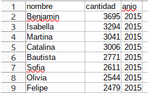

# Trabajo práctico N°2

## Taller de GUI

En el Centro de Formación Profesional, todos los años se realiza una muestra en la que cada curso expone material que van realizando a lo largo del año.

La programación tiene su complejidad y lo hemos visto durante el curso, para el resto de personas puede no ser llamativo o entender el código fuente de un programa orientado a objetos siguiendo las mejores prácticas sin embargo, pueden apreciar mas un programa con interface gráfica.

En el curso no hemos visto GUI (Interfaces gráficas de usuario por su siglas en inglés) porque nos enfocamos puramente en programación. Pero también hemos visto el uso de librerías que pueden facilitarnos gran parte del desarrollo, como por ejemplo una interface gráfica.

Existen numerosas librerías para realizar interfaces gráficas para aplicaciones de escritorio (desktop), web, para dispositivos móviles, etc.

Para este taller de GUI proponemos dos alternativas para realizar aplicaciones, pero dejando abierta la oportunidad para que el o la alumna decida cualquier otro:

- Aplicaciones de escritorio utilizando la librería [Tkinter](https://docs.python.org/es/3/library/tkinter.html) 
- Un mini-juego utilizando [arcade](https://api.arcade.academy/en/latest/) o [pygame](https://www.pygame.org/news)

# Ejercicios

Intente realizar los siguientes ejercicios para que algunos de ellos puedan estar en la muestra.

Para ir practicando lo visto con git en las clases anteriores, cree un nuevo repositorio en su cuenta, llamado por ejemplo `tp2-cfp410` donde va a ir subiendo los ejercicios.

Luego, comparta el repositorio con el profesor para que pueda ser evaluado y accesible para el día de la muestra.

Realice los que mas pueda. Le servirá para tener un primer contacto con diseño de GUI simples.

## Saludo por GUI

Desarrolle un programa que tome por un input el nombre de una persona y lo salude.

Pista:
- [Ejercicio resuelto](https://github.com/kity-linuxero/prog_CFP410/blob/main/practicas/ejercicios_en_clase/gui/saludo/saludo_gui.py)

## Generador de contraseñas

En el [Lab1](https://github.com/kity-linuxero/prog_CFP410/blob/main/labs/lab1.md#ejercicio-2) hicimos un generador de contraseñas. Puede realizar una GUI para generar contraseñas y mostrarlas en pantalla.

Pista:
- [Ejercicio resuelto](https://github.com/kity-linuxero/prog_CFP410/tree/main/practicas/ejercicios_en_clase/gui/generador_passwd/)

## Descargador de contenido de YouTube
En el Lab3, se vió como usar la librería `pytube` para descargar contenido de Youtube.
En este ejercicio se pide hacer una interface gráfica para realizarlo.

Pista:
- [Ejercicio resuelto](https://github.com/kity-linuxero/prog_CFP410/tree/main/practicas/ejercicios_en_clase/gui/youtube-download/youtube_gui.py)

## Piedra, papel y tijera

Realice una interfaz gráfica para el [ejercicio 10](https://github.com/kity-linuxero/prog_CFP410/blob/main/practicas/practica2.md#ejercicio-10) de la práctica 2. Si puede reutilice el código hecho o bien, con los conocimientos posteriores adquiridos reescriba el programa de piedra-papel y tijeras para que quede de forma mas eficiente.

Separe la interfaz gráfica de la lógica del juego en dos módulos por separado.

## Temperatura media de los días de la semana

Desarrolle una interfaz gráfica para el [ejercicio 4](https://github.com/kity-linuxero/prog_CFP410/blob/main/practicas/practica4.md#ejercicio-4) de la práctica 4. Donde se recibían las temperaturas medias de cada día de la semana y el programa calculaba qué días se dió la máxima y la mínima.

## Sorteo

Desarrolle una aplicación con gui que permita realizar un sorteo, tipo "rifa" en la que se vayan agregando nombres de personas y cada una elije un número que cuando finalice la toma de números se realice el sorteo y se informe al ganador o ganadora si hubo alguien. Si no hubo nadie, debe dar opción para volver a sortear.

Pistas:
- Puede ayudarse de los  [Listbox](https://recursospython.com/guias-y-manuales/lista-listbox-en-tkinter/) de Tkinter para ir listando a las personas (opcional).
- En la práctica 4, [ejercicio 10](https://recursospython.com/guias-y-manuales/lista-listbox-en-tkinter/) se realizó algo parecido, puede ver su código y modificarlo para adaptarlo.

## Nombres de personas físicas en Argentina

En [datos.gob.ar] se publican datos de relevancia de la República Argentina. Entre esos datos de acceso público, se encuentra la cantidad de personas registradas por nombre y por año.
Por ejemplo, en este [link](https://infra.datos.gob.ar/catalog/otros/dataset/2/distribution/2.21/download/nombres-2015.csv) puede descargarse un _csv_ con los nombres ordenado por la cantidad de gente anotada en el año 2015.

Por ejemplo, puede verse que el nombre con mayor inscripciones fue _Benjamin_ con 3695, seguido por _Isabella_ con 3294.

Desarrolle un programa que le pida al usuario su nombre y le informe la cantidad de gente anotada con su nombre y en que puesto está su nombre.

Los datos se los puede descargar de [datos.gob.ar](https://datos.gob.ar/dataset/otros-nombres-personas-fisicas). Verá que en algunos archivos los nombres están agrupados en varios años. Elija el que mas le parezca, pero no olvide citar la fuente e informar en alguna parte del programa cual archivo se usó.

Si bien en el pasado hemos usado archivos _csv_ para procesarlos y obtener datos, puede apoyarse de la librería [csv](https://docs.python.org/es/3/library/csv.html) para hacerle mas fácil la extracción de los datos.

## Juego

(WIP)

#### Documentación adicional:
- [Introducción a Tkinter](https://recursospython.com/guias-y-manuales/introduccion-a-tkinter/)
- [Mas recursos Tkinter](https://recursospython.com/tag/tkinter/)
- [Documentación Arcade](https://api.arcade.academy/en/latest/get_started.html)
- [Cómo hacer un juego con PYGAME en 10 minutos](https://openwebinars.net/blog/como-hacer-un-juego-con-pygame-en-10-minutos/)
- Juego de [plataforma](https://api.arcade.academy/en/latest/examples/index.html#platformers) (estilo Mario Bross)
- Juego de [naves](https://api.arcade.academy/en/latest/examples/index.html#shooting-with-sprites) (estilo Space Invaders)

